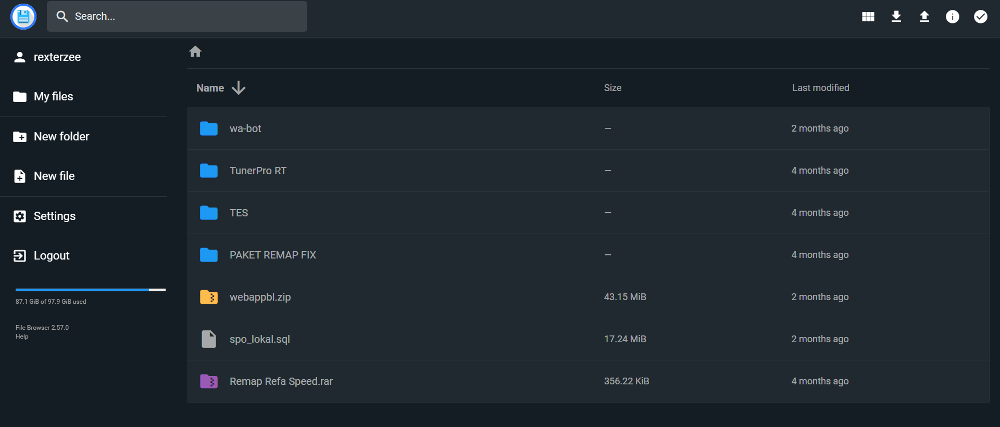
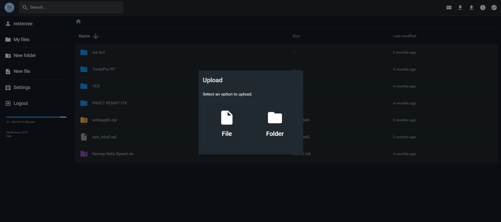

# ☁️ Private Cloud Storage & Tunnel Server

Layanan penyimpanan cloud pribadi berbasis server Linux yang dapat diakses melalui internet menggunakan tunnel server.

## 📌 Tentang Project

Project ini dibuat sebagai alternatif penyimpanan cloud pribadi yang memiliki fungsi mirip Google Drive untuk menyimpan, mengelola, dan mengakses file dari mana saja.

## 👨‍💻 Role

System Administrator & Full Stack Developer

## 🛠️ Tanggung Jawab

- Instalasi server Linux
- Konfigurasi web server
- Konfigurasi database
- Setup tunnel server
- Implementasi sistem cloud storage
- Monitoring dan maintenance server

## ✨ Fitur

- Upload file
- Download file
- Manajemen folder
- Manajemen user
- Hak akses file
- Akses melalui internet
- Penyimpanan terpusat
- Backup data

## 🏗️ Infrastruktur

- Linux Server
- Web Server
- Database Server
- Tunnel Server
- Remote Access System

## 🏗️ Tech Stack

- Linux
- Apache
- Nginx
- PHP
- MySQL
- HTML
- CSS
- JavaScript
- Git

## 📷 Screenshot

### Dashboard

### File Manager

### Upload File

### Server Architecture

## 📚 Yang Saya Pelajari

- Linux Administration
- Server Deployment
- Networking
- Remote Access
- Security Basics
- Backup Management
- Self Hosting Infrastructure

---

⚠️ Repository ini merupakan portfolio project. Detail konfigurasi server dan akses produksi tidak dipublikasikan demi keamanan sistem.
